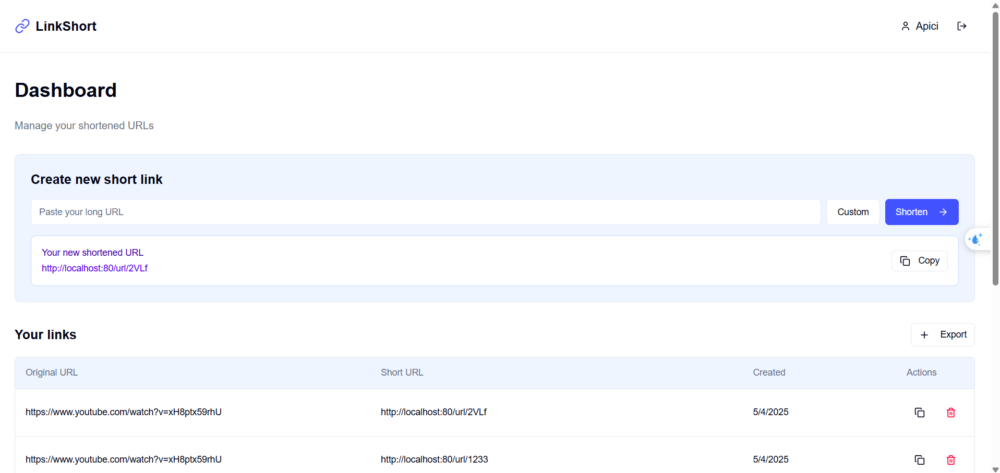
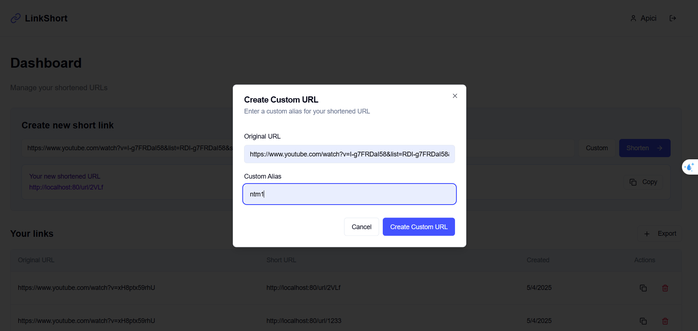
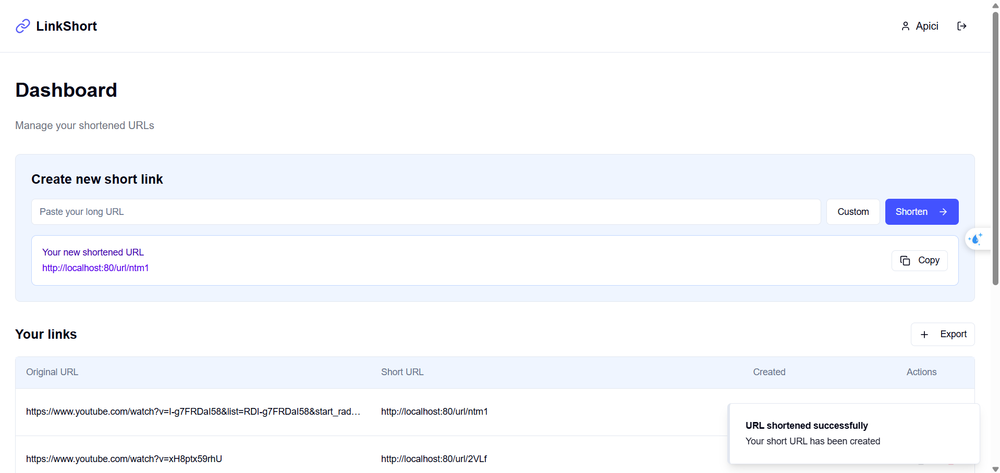

# CASE STUDY 1: Bài tập nhóm Kiến trúc phần mềm

## 🧑‍🤝‍🧑 Thành viên nhóm

1. Ngô Thành Minh - 22021131 
2. Nguyễn Việt Anh - 22021162
3. Nguyễn Thị Hoài Thu - 22021135

## 📌 Mô tả dự án

Dự án này nhằm mục đích triển khai hệ thống rút gọn link sử dụng mã hóa Base62 (sử dụng các kí tự A-Z, a-z, 0-9 để tạo ra link rút gọn), hỗ trợ mở rộng bằng Zookeeper, sử dụng hệ cơ sở dữ liệu MongoDB kết hợp cùng ODM Mongoose và tăng tốc truy xuất nhờ Redis và Bloom Filter. Hệ thống có giao diện web thân thiện, middleware ghi log, và được tối ưu hiệu suất để đáp ứng yêu cầu mở rộng và ổn định.

## 🚀 Công nghệ sử dụng

- Frontend: NextJs
- Backend: NestJS, Zookeeper, Redis, Redis Bloom, Mongooes, JWT.
- Cơ sở dữ liệu: MongoDB

## 📝 Hướng dẫn chạy dự án

```bash
Download Docker

# Run Command
docker compose up --build -d

```

## Link liên quan

Front End Repository: https://github.com/Ng-Vanh/url-shortener

Báo cáo: [Báo cáo](https://drive.google.com/file/d/1lQ2i6yCbkzinb4crpFuIkFeWHLt4qOhx/view)

## Demo trang web
1. Giao diện Dashboard



2. Tuỳ chỉnh URL theo nhu cầu



3. Link rút gọn hoàn thành




