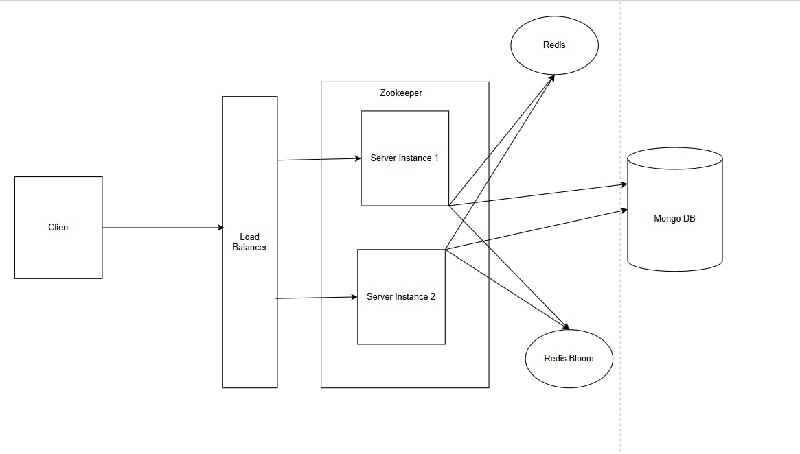
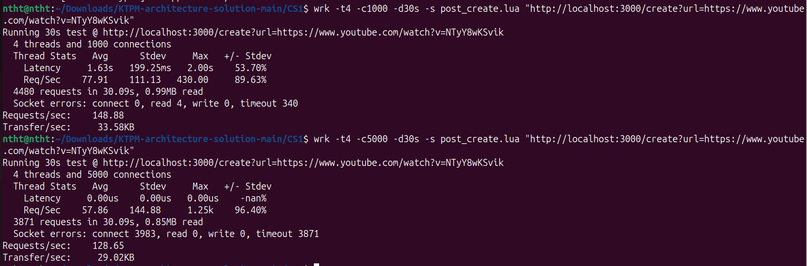
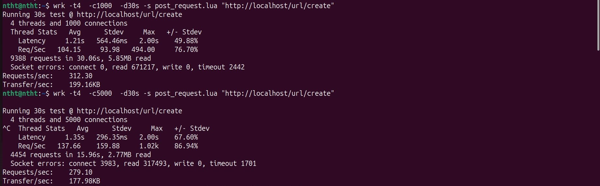
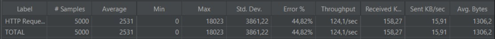
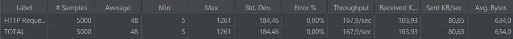
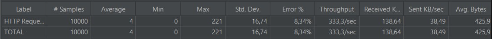
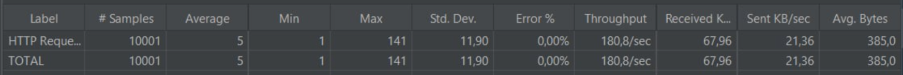

# CASE STUDY 1: Bài tập nhóm Kiến trúc phần mềm

## 1. Thành viên nhóm

1. Ngô Thành Minh - 22021131 
2. Nguyễn Việt Anh - 22021162
3. Nguyễn Thị Hoài Thu - 22021135

## 2. Mô tả dự án

Dự án này nhằm mục đích triển khai hệ thống rút gọn link sử dụng mã hóa Base62 (sử dụng các kí tự A-Z, a-z, 0-9 để tạo ra link rút gọn), hỗ trợ mở rộng bằng Zookeeper, sử dụng hệ cơ sở dữ liệu MongoDB kết hợp cùng ODM Mongoose và tăng tốc truy xuất nhờ Redis và Bloom Filter. Hệ thống có giao diện web thân thiện, middleware ghi log, và được tối ưu hiệu suất để đáp ứng yêu cầu mở rộng và ổn định.

## 3. Công nghệ sử dụng

- Frontend: NextJs
- Backend: NestJS, Zookeeper, Redis, Redis Bloom, Mongooes, JWT.
- Cơ sở dữ liệu: MongoDB

## 4. Hướng dẫn chạy dự án

```bash
Download Docker

# Run Command
docker compose up --build -d

```

## 5. Cách triển khai

Cách triển khai chi tiết được trình bày trong báo cáo dưới đây.

Báo cáo: [Báo cáo](https://drive.google.com/file/d/1lQ2i6yCbkzinb4crpFuIkFeWHLt4qOhx/view)



*Hình ảnh trên biểu diễn kiến trúc hệ thống đã triển khai trong bài tập lớn này.*

Nhóm đã áp dụng phương pháp Encode Base62 kết hợp Zookeeper và Redis. Cụ thể là tạo ID duy nhất cho mỗi URL, ID tăng dần theo thứ tự. Sau đó thực hiện phép XOR ID với một secret number, kết quả thu được sẽ được chuyển sang hệ cơ số 62 ([0-9, a-z, A-Z], 62 ký tự), và giới hạn đầu ra ở 7 ký tự. Phương pháp này có thể tạo ra 3.5 nghìn tỷ link rút gọn.

Phương pháp sử dụng ID duy nhất giúp loại bỏ việc kiểm tra trùng lặp khi tạo link rút gọn. Tuy nhiên, khi hệ thống mở rộng với nhiều instance, cần cơ chế phân phối ID để tránh xung đột. Zookeeper được sử dụng để cấp phát các khoảng ID riêng biệt cho từng instance, đảm bảo tính duy nhất. Bên cạnh đó, do tỷ lệ đọc/ghi là 100:1, việc truy vấn cơ sở dữ liệu thường xuyên sẽ gây quá tải. Để khắc phục, Redis được dùng làm lớp cache lưu các URL rút gọn giúp giảm truy vấn và cải thiện hiệu suất hệ thống.

Để hỗ trợ đuôi tùy chỉnh cho link rút gọn, hệ thống phải đảm bảo đuôi chưa từng được sử dụng. Khi dữ liệu lớn, việc truy vấn cơ sở dữ liệu gây giảm hiệu suất. Nhóm đã dùng Bloom Filter để kiểm tra nhanh sự tồn tại của đuôi, giảm truy vấn không cần thiết. Nếu Bloom Filter cho thấy đuôi chưa tồn tại, thì thêm link rút gọn đó vào database. Nếu Bloom Filter cho thấy đuôi có thể đã tồn tại, hệ thống kiểm tra tiếp trong Redis và cuối cùng là database. Để đảm bảo nhất quán giữa nhiều instance, Redis Bloom được tích hợp nhằm quản lý Bloom Filter tập trung, từ đó cải thiện khả năng mở rộng hệ thống.

Ngoài ra, ứng dụng triển khai middleware để ghi log toàn bộ request và response nhằm hỗ trợ giám sát và gỡ lỗi. Mongoose được dùng để tương tác với MongoDB, đảm bảo tính toàn vẹn dữ liệu qua schema. Hiệu năng được cải thiện nhờ sử dụng Redis làm cache, Zookeeper phân phối ID và Bloom Filter loại bỏ truy vấn không cần thiết. 

Giao diện web được xây dựng bằng Nextjs giúp gửi URL và nhận lại link rút gọn hoặc tùy chọn đuôi URL với độ dài từ 3 - 16 ký tự, sau đó hiển thị URL rút gọn kèm theo chức năng sao chép nhanh vào bộ nhớ tạm. Hệ thống cũng tích hợp cơ chế xử lý lỗi cơ bản nhằm thông báo cho người dùng khi đầu vào không hợp lệ. Bên cạnh đó, giao diện còn lưu lại lịch sử các URL đã được tạo, giúp người dùng dễ dàng truy xuất lại các liên kết trước đó.

## 6. Đánh giá hiệu năng

### 1. Đánh giá sử dụng công cụ wrk
Đây là kết quả đánh giá hiệu năng trong ví dụ mẫu (`wrk_1.jpg`)



Còn đây là kết quả đánh giá hiệu năng của phương pháp đề xuất (`wrk_2.jpg`)



So sánh kết quả benchmark giữa hai phiên bản (ảnh `wrk_1.jpg` và `wrk_2.jpg`) cho thấy rõ sự cải thiện vượt bậc trong `wrk_2.jpg` là cách triển khai rút gọn link đã đề cập. Với cùng cấu hình **4 threads và 1000 connections**, throughput tăng từ **148.88 req/s lên 312.30 req/s** (gấp hơn **2 lần**), trong khi **latency giảm từ 1.63s xuống 1.21s**.  

Với **5000 connections**, hệ thống mới vẫn duy trì hiệu năng cao hơn với **279.10 req/s** so với **128.65 req/s** trước đó. Một điều ta có thể thấy rõ ràng đó là trong `wrk_1.jpg` không đủ khả năng xử lý đồng thời số lượng lớn request (5000 connections), gây ra hiện tượng timeout và lỗi kết nối hàng loạt.

### 2. Đánh giá sử dụng công cụ jmeter
#### 2.1. Đánh giá chức năng tạo link rút gọn


Tương tự ảnh 1 là kết quả đánh giá của phương pháp mẫu, còn 2 ảnh là kết quả đánh giá được trình bày trong bài tập lớn này. Cụ thể, ta có thể thấy:

- Tỉ lệ lỗi (Error %) bằng 0%, cho thấy toàn bộ 5000 yêu cầu HTTP đều thành công, trong khi ví dụ mẫu là 44,82% — một minh chứng rõ ràng cho độ ổn định của hệ thống.

- Thời gian phản hồi trung bình chỉ 48ms, thấp hơn rất nhiều so với 2531ms ở ảnh 1, chứng tỏ hệ thống phản hồi nhanh chóng và hiệu quả.

- Throughput đạt 167.9 request/sec, cao hơn ảnh 1 dù độ trễ giảm mạnh, chứng tỏ khả năng xử lý song song tốt hơn.

- Lượng dữ liệu gửi và nhận tăng mạnh (Sent KB/sec: 80.65, Received KB/sec: 103.93), nghĩa là hiệu năng truyền tải cao hơn nhiều.

#### 2.2. Đánh giá chức năng đọc link rút gọn


Hai ảnh trên lần lượt là kết quả đánh giá hiệu năng của việc đọc link rút gọn của phương pháp mẫu và phương pháp mới đã được cải tiến. Với cấu hình **10000 connections** trong thời gian 30s, ta có thể thấy rõ ràng phương pháp mới tốt hơn, Cụ thể:
- Tỉ lệ lỗi ở ảnh 1 là 8.34% còn trong ảnh 2 là 0%
- Average ở ảnh 1 bằng 4, ảnh 2 bằng 5


Từ đó thấy rằng phương pháp của nhóm thể hiện sự cải tiến rõ rệt về tính ổn định và độ chính xác.

## 7. Link liên quan

Front End Repository: https://github.com/Ng-Vanh/url-shortener

## 8. Demo trang web
1. Giao diện Dashboard


2. Tuỳ chỉnh URL theo nhu cầu


3. Link rút gọn hoàn thành


